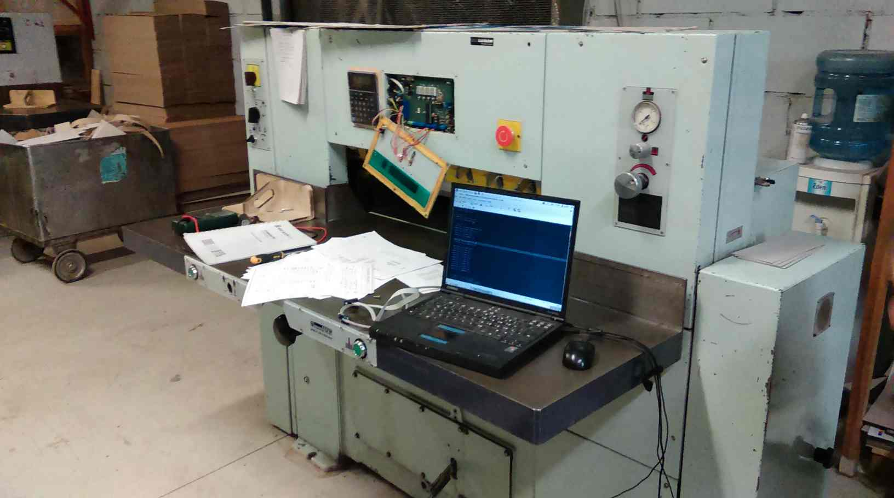
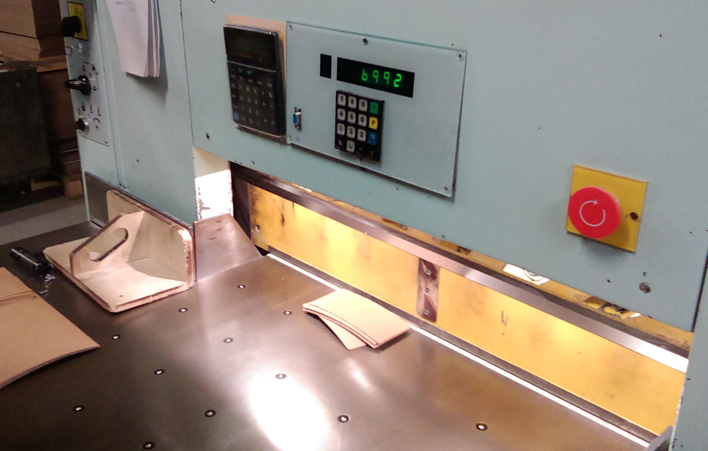
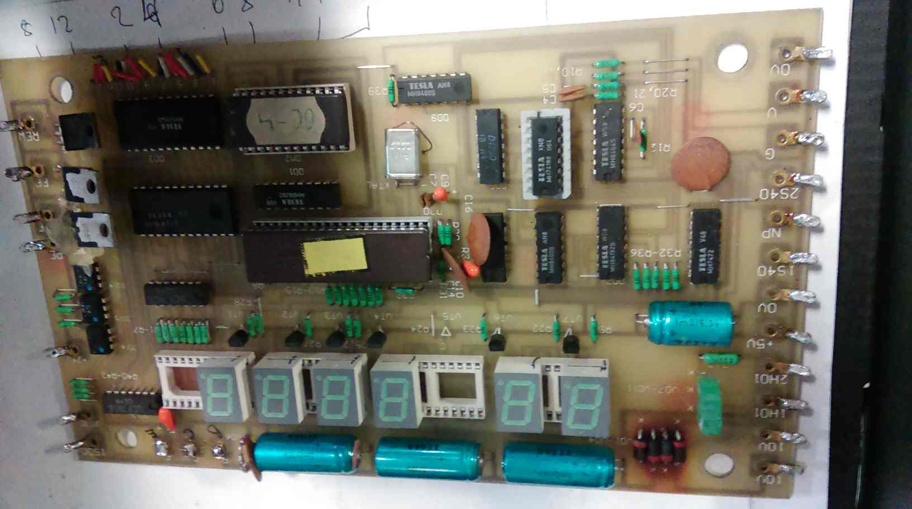
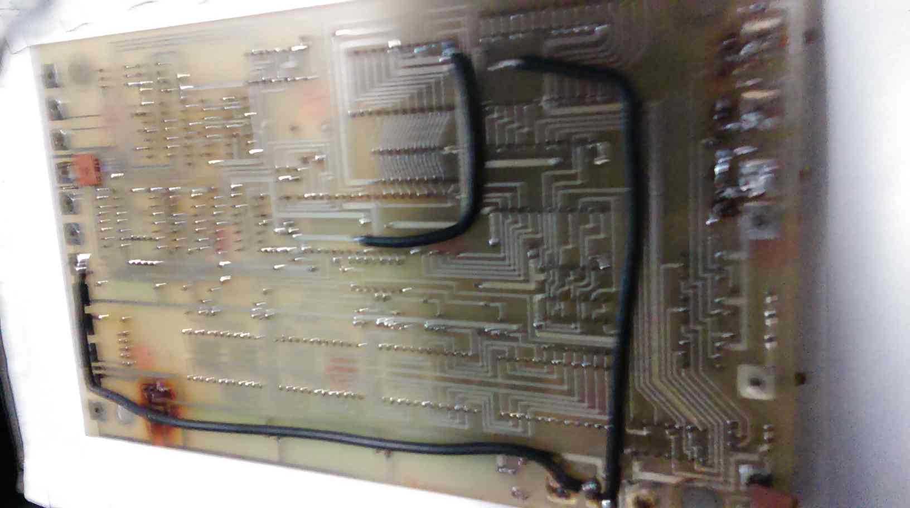
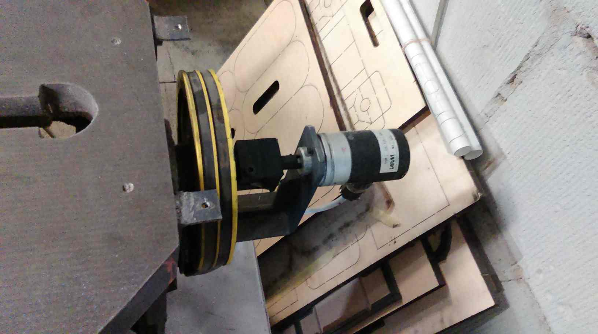
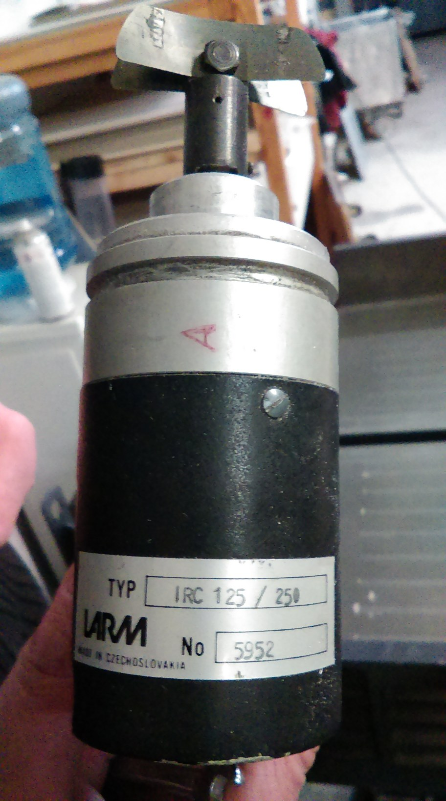
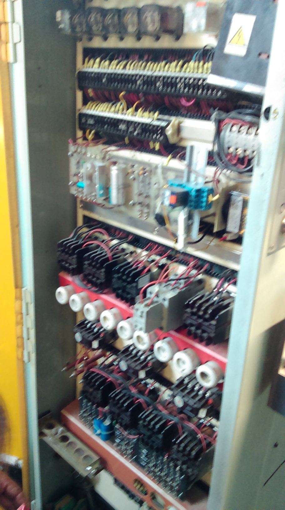
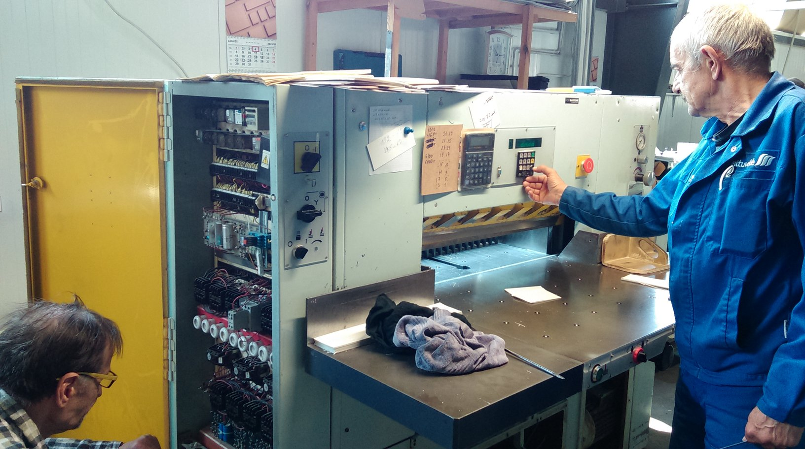

## Introduction

Adast Maxima MS80 is a paperboard cutting machine (guillotine) produced in the Czech Republic in the early 1990s. Still in operation in Vilnius, September 2023.

<table>
<tr>
<th style="text-align:center"> Adast Maxima MS80 under Repair</th>
</tr>
<tr>
<td>

</td>
</tr>
</table>

The repair was executed jointly by me and Saulius Rakauskas in about one week on February 2020. He got the client (the factory owner), disassembled the machine, located the problem, designed a new circuit board, did all the soldering and hardware testing. I only wrote the C program for the ATmega16 microcontroller with which we replaced the original Tesla chipset. 

<table>
<tr>
<th style="text-align:center"> Adast Maxima MS80 in Action</th>
</tr>
<tr>
<td>

</td>
</tr>
</table>

## Problem Setting

An accident due to the electric current overload in the factory burnt the main circuit board, see below. Its fusers went off, but the board died first.

<table>
<tr>
<th style="text-align:center"> Circuit Board: Front </th>
<th style="text-align:center"> Circuit Board: Back </th>
</tr>
<tr>
<td>

</td>
<td>

</td>
</tr>
</table>

The microcontroller did not survive, so we had to make a new circuit board from what was salvaged. The exact operating regimes and work flows were lost, but the main function, the precise electronic guillotine (knife) positioning and cutting, was retained.

Remarkably, there exists a commercial solution/middleware designed to tackle this very specific problem, see i.e. [PD-04][1] which provides a rotary encoder along with the microcontroller based circuit board with the program designed for paper cutting machines. The PD-04 system is somewhat expensive for the replacements in these old machines. It costs [around 1220 euro (2023)](https://www.en.chip-elektronika.pl/readers-programmers-for-paper-cutters/control-system-pd-04/) for the hardware alone, and it takes two men (a mechanician and an electrical engineer) and several days to install it. This did not play well with the risks. Nobody knew for sure if PD04 would work on this particular old Adast Maxima, without the need to replace the motor and relays which would further increase the costs.

## Adast Maxima MS80

The machine operation breaks into the three stages:

1. The operator enters the distance value.
2. The machine repositions its guillotine.
3. The operator triggers the cutting.

There are a few other modes, but they are not essential. The position is sensed via a rotary encoder which, along with the guillotine, is shown in the photos below. The fourth picture shows a disk-like handle used to manually exit the emergency situations (e.g. lift the guillotine up if it gets stuck during the cutting as the electricity disappears).

<table>
<tr>
<th> Guillotine </th>
<th> Rotary Encoder</th>
</tr>
<tr>
<td>

</td>
<td>

</td>
</tr>
</table>

<table>
<tr>
<th> Rotary Encoder </th>
<th> Deadlock Handling </th>
<th> Electrical Relays </th>
</tr>
<tr>
<td>

</td>
<td>

</td>
<td>

</td>
</tr>
</table>

<table>
<tr>
<th style="text-align:center"> Unsung Heroes, May 2023</th>
</tr>
<tr>
<td>

</td>
</tr>
</table>

## Code

The code is written for the [ATmega16/32][4] microcontroller and the avr-gcc compiler. The chip has 32 IO pins which we considered plenty. This turned out to be a very tight choice. It would have been better to apply a ready-made array of 7-segment LED indicators with a keypad, both based on the 2 wire/I2C interfaces, in order to reduce soldering effort. However, we wanted to match the board with the specific digit indicators and the factory panel.

The code implements the three phases: (i) initial calibration, (ii) target distance setup, and (iii) knife motion/positioning. There are all sorts of minor complications that probably do not deserve a textual description here, one should simply see the code. 
  
Initially, when turning the machine on, the guillotine's position is unknown and it is located where it has been left when the machine has been switched off. There is no distance value to read from the permanent memory, nor such a method would be viable. All we know is that: (i) the guillotine is somewhere in between the starting marker (approx. 20mm) and the end wall (approx. 810mm), (ii) there is a sensor located approximately at the 225mm from the starting marker, and (iii) the sensor sends the most precise signal only when the guillotine passes the sensor from the forward direction, that is when moving from the end towards the start.

Since the position of the knife is unknown initially, and we do not know in which direction its only calibrating sensor will be reached, an operator needs to see a rough location of a knife and move it manually so that the knife passes the sensor. This is not as automatic or convenient as it should be, but it is the price we pay for having only a single distance-calibrating sensor.

The code may resync the distance value whenever the knife passes the sensor, but these parts are commented out. There are options to position the knife so that it first passes the target value by 5cm and then comes back, supposedly to always make the final stop from the forward direction.

## Precision 

The loss of precision can happen in two distinct ways: (i) in a cumulative/catastrophic loss, and (ii) as a constant bias which can be alleviated.

The first category includes the single most critical parameter of this system, i.e. the distance traveled per encoder impulse, in microns (MPS). This value must be known precisely, otherwise the error will accumulate in time. The encoder specification states that MPS=40mu, and we halve this value by reading the AB-states of the rotary encoder in a certain manner. However, we do not know the MPS deviation and whether the original system has not been corrected in code, via some precision/laser measurement.

Let MPS = 40mu. After 10K impulses the distance becomes 40mu x 10000 = 40cm.

Suppose that the real value MPS = 40.1mu. Then, 40.1mu x 10000 = 40.1cm. One tenth of a micron accumulates into the whole millimeter, and this is just a single 40cm. movement. After ten such movements, the error will be 1cm!

This example shows that a standard ruler with a millimeter scale and the movement of 10000 impulses can determine only the first decimal part of the micron. Given the millimeter scale, we need to measure longer distances, e.g. 100K-impulse motion leading to, say, 400.4cm would produce MPS = 400.4cm/1e5 = 40.04mu. This is not possible to do, unfortunately, since the maximal guillotine travel is about 80cm. We could use a more precise caliper, but typically its maximal range will only be 4cm and the accuracy of 0.1mm, which gives us nothing.

Another way towards a greater accuracy is to increase the number of impulses. The quadrature encoder outputs two binary signals A and B which produce four states per cycle. These states can be counted, increasing the number of impulses and hence resolution 4x. This is still insufficient, but consider how much the number of impulses matters with the following example. Suppose a guessed MPS=40mu and we measure the distance traveled with only 25 generated impulses. This is about 1mm of travel, which, when measured with a millimeter accuracy, leads to 100% error. Whereas in the example above with 10K impulses, the relative error will be (40.1-40.0)/40 = 0.25%.  

Therefore, we cannot determine MPS with an adequate precision by means of a mm-ruler. We can only verify that the integral micron part is 40mu and see if the decimal part is close to zero, which seems to be the case.

The second group of errors add a constant bias to the distance value. For instance, the sensor position is known only approximately with a millimeter precision of a standard ruler which might introduce a mm/sub-mm bias in the real and displayed knife position. The bias is constant though, so it does not accumulate into the cascaded loss of precision with each knife movement; it can be measured and accounted for, in code. A similar case holds for the potentially imprecise stopping distance values. The only requirement/hope is that they are constant, which is the case only with a single speed and distances larger than a few centimeters. A stopping distance depends on the knife movement direction, which is accounted for in the code. 

## Additional Remarks

- The machine is a technological marvel of precision mechanics, hydraulics, electrical relay engineering, and the microcontroller logic. It is very heavy and experiences huge mechanical vibrations, yet it has been maintaining mm-precision and continuity throughout long working hours for years.

- Repairing a microcontroller unit (MCU) based board will seldom be economically viable. 
  Rewriting a microcontroller program demands rediscovering bits of the original R&D, which takes time, but the benefit of scaling is lost. 
  The result is just one repaired device, not many of them sold after the original R&D.

- The Polish PD04 "middleware" is a clever transformation of one such repairing process to a commercial product.

- The machine is surprisingly long lasting. The motor brake system does start to give up under a heavy load, it occasionally refuses to move the knife. A hydraulic gear had once caught some sawdust and jammed the knife lifting mechanism. 

- The factory owner has bought another similar used Adast guillotine which is a newer model. Its electrical relays occasionally lose contact. Compared to the older model, they are less protected against the mechanical vibrations as the relays lack special jackets to keep them tight.

## Update, December 2023

The machine exhibits discontinuities after tens of minutes of work. Once cooled, it works well initially, but the knife movement experiences disruptions again after for some tens of minutes. It is not clear if this is due to burnt resistors that control some relays, or the motor. The program is fine.

We started working on a new system by adding a frequency inverter which allows to vary the motor speed, and to remove a shaky brake system.

In about a week we tested a modified ATmega32 program (main_inverter.c vs main_old_way.c) which outputs 1V signal of 1KHz with a variable duty percentage. This signal is then fed to a small custom (R, C, transistor) circuit which outputs the DC signal in the range of 0..60V whose value depends on the duty percentage. The output controls [the LS M100](https://inverterdrive.com/group/AC-Inverter-Drives-230V/LS-LSLV-0008-M100-1EOFNS/) inverter connected to the motor. 

The modified program works, and we even fine-tuned the braking distance parameters as the motor brake is now completely removed (fewer problem links to worry about). There are still two problems to solve:

* We cannot make the inverter output frequencies higher than 60Hz (the declared range is 0..400Hz). The motor is not lively enough with a 60Hz input.

* We suspect that the motor has its own problems, or it is not a good match with this frequency inverter. We cannot make it move the knife fast (not a big deal), and we cannot make it move the knife very slowly as the motor simply halts, but only when moving in one specific direction. 

A very slow knife movement is needed to combat the braking distance, and we do not want to rely on the external braking. 
  
The machine works, but we still await some new feedback and a new motor which will reveal whether the problem is in the link "inverter-motor", or it has something to do with relays.

In the new system, a lot depends on the inverter settings. For better or worse, inverter's acceleration/deceleration times can impact the knife's braking distance. These precise values need to be stored somewhere in the case of accidental reboot to the factory settings. 

Minor note: "_delay_ms" is not a reliable function with ATmega16/32. Choosing fuse bits to correspond to the internal 8MHz oscillator, and specifying #define F_CPU 8000000UL does not guarantee proper delays. The program works fine until adding the timer1 code in main.c, which makes the program "tick" at 1MHz for some reason. Choosing the default 1MHz setup corrected the "_delay_ms", but made the timer1 tick 4x slower than expected (based on the new frequency and prescalings). These problems are easy to solve by simply measuring the ATmega output with an oscilloscope/oscillograph, followed by adjusted prescalings. This patching solves the problem, but it does not reveal the real reason behind these mismatches. 

TBC...  
  
## References

- [PD-04][1]
- [rotary-encoder][2]
- [vytassblog][3]
- [ATmega16][4]
- [A Tutorial on Portable Makefiles, 2017](https://nullprogram.com/blog/2017/08/20/)
- [A Tutorial on Portable Makefiles, Comments on Hacker News](https://news.ycombinator.com/item?id=32303193)

[1]: https://www.en.chip-elektronika.pl/readers-programmers-for-paper-cutters/control-system-pd-04/
[2]: https://howtomechatronics.com/tutorials/arduino/rotary-encoder-works-use-arduino/
[3]: http://blog.elektronika.lt/vytassblog/?page_id=113
[4]: https://components101.com/microcontrollers/atmega16-pinout-features-datasheet
