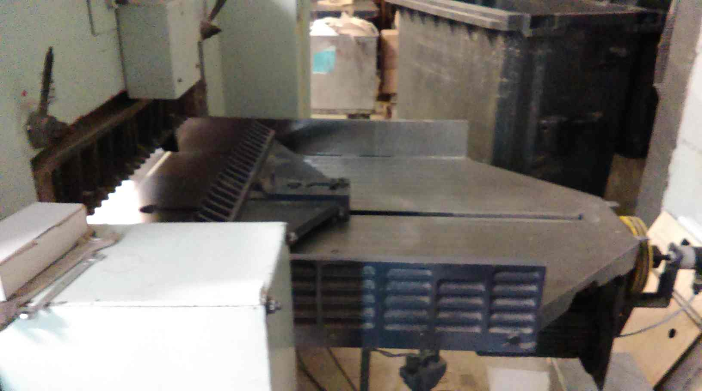
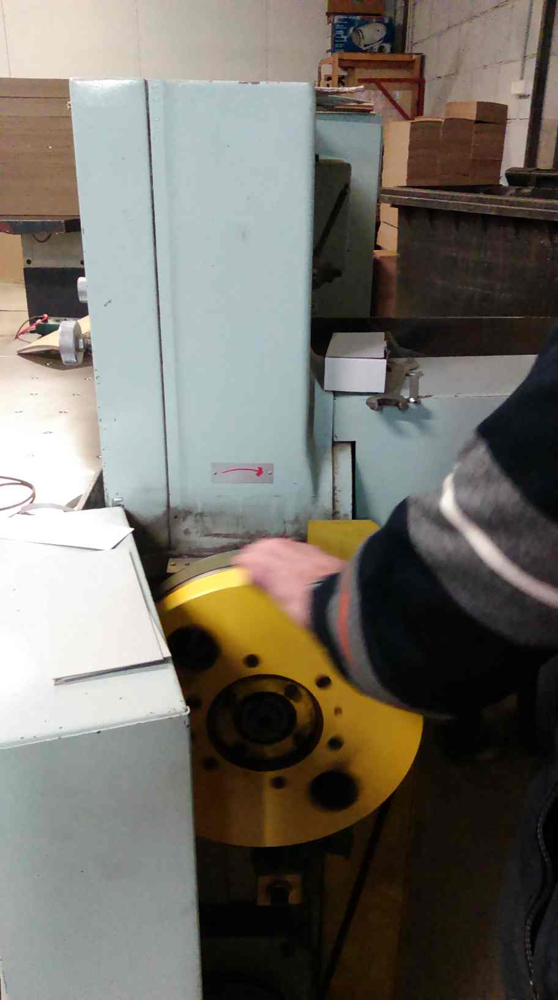

## Introduction

Adast Maxima MS80 is a paperboard cutting machine (guillotine) produced in the Czech Republic in the early 1990s. Still in operation in Vilnius, February 2024.

<table>
<tr>
<th style="text-align:center"> Adast Maxima MS80 under Repair</th>
</tr>
<tr>
<td>

</td>
</tr>
</table>

The repair was executed jointly by me and Saulius Rakauskas in about one week on February 2020. He got the client (the factory owner), disassembled the machine, located the problem, designed a new circuit board, did all the soldering and hardware testing. I only wrote the C program for the ATmega16/32 microcontroller with which we replaced the original Tesla chipset. 

<table>
<tr>
<th style="text-align:center"> Adast Maxima MS80 in Action</th>
</tr>
<tr>
<td>

</td>
</tr>
</table>

## Problem Setting

An accident due to the electric current overload in the factory burnt the main circuit board, see below. Its fusers went off, but the board died first.

<table>
<tr>
<th style="text-align:center"> Circuit Board: Front </th>
<th style="text-align:center"> Circuit Board: Back </th>
</tr>
<tr>
<td>


</td>
<td>


</td>
</tr>
</table>

The microcontroller did not survive, so we had to make a new circuit board from what was salvaged. The exact operating regimes and work flows were lost, but the main function, the precise electronic guillotine (knife) positioning and cutting, was retained.

Remarkably, there exists a commercial solution/middleware designed to tackle this very specific problem, see i.e. [PD-04][1] which provides a rotary encoder along with the microcontroller based circuit board with the program designed for paper cutting machines. The PD-04 system is somewhat expensive for the replacements in these old machines. It costs [around 1220 euro (2023)](https://www.en.chip-elektronika.pl/readers-programmers-for-paper-cutters/control-system-pd-04/) for the hardware alone, and it takes two men (a mechanician and an electrical engineer) and several days to install it. This did not play well with the risks. Nobody knew for sure if PD04 would work on this particular old Adast Maxima, without the need to replace the motor and relays which would further increase the costs.

## Adast Maxima MS80

The machine operation breaks into the three stages:

1. The operator enters the distance value.
2. The machine repositions its guillotine.
3. The operator triggers the cutting.

There are a few other modes, but they are not essential. The position is sensed via a rotary encoder which, along with the guillotine, is shown in the photos below. The fourth picture shows a disk-like handle used to manually exit the emergency situations (e.g. lift the guillotine up if it gets stuck during the cutting as the electricity disappears).

<table>
<tr>
<th> Guillotine </th>
<th> Rotary Encoder</th>
</tr>
<tr>
<td>



</td>
<td>


</td>
</tr>
</table>

<table>
<tr>
<th> Rotary Encoder </th>
<th> Deadlock Handling </th>
<th> Electrical Relays </th>
</tr>
<tr>
<td>


</td>
<td>



</td>
<td>


</td>
</tr>
</table>

<table>
<tr>
<th style="text-align:center"> Unsung Heroes: Saulius and Igor, May 2023</th>
</tr>
<tr>
<td>

</td>
</tr>
</table>

## Code

The code is written for the [ATmega16/32][4] microcontroller and the avr-gcc compiler. The chip has 32 IO pins which we considered plenty. This turned out to be a very tight choice. It would have been better to apply a ready-made array of 7-segment LED indicators with a keypad, both based on the 2 wire/I2C interfaces, in order to reduce soldering effort. However, we wanted to match the board with the specific digit indicators and the factory panel.

The code implements the three phases: (i) initial calibration, (ii) target distance setup, and (iii) knife motion/positioning. There are all sorts of minor complications that probably do not deserve a textual description here, one should simply see the code. 
  
Initially, when turning the machine on, the guillotine's position is unknown and it is located where it has been left when the machine has been switched off. There is no distance value to read from the permanent memory, nor such a method would be viable. All we know is that: (i) the guillotine is somewhere in between the starting marker (approx. 20mm) and the end wall (approx. 810mm), (ii) there is a sensor located approximately at the 225mm from the starting marker, and (iii) the sensor sends the most precise signal only when the guillotine passes the sensor from the forward direction, that is when moving from the end towards the start.

Since the position of the knife is unknown initially, and we do not know in which direction its only calibrating sensor will be reached, an operator needs to see a rough location of a knife and move it manually so that the knife passes the sensor. This is not as automatic or convenient as it should be, but it is the price we pay for having only a single distance-calibrating sensor.

The code may resync the distance value whenever the knife passes the sensor, but these parts are commented out. There are options to position the knife so that it first passes the target value by 5cm and then comes back, supposedly to always make the final stop from the forward direction.

## Precision 

The loss of precision can happen in two distinct ways: (i) in a cumulative/catastrophic loss, and (ii) as a constant bias which can be alleviated.

The first category includes the single most critical parameter of this system, i.e. the distance traveled per encoder impulse, in microns (MPS). This value must be known precisely, otherwise the error will accumulate in time. The encoder specification states that MPS=40mu, and we halve this value by reading the AB-states of the rotary encoder in a certain manner. However, we do not know the MPS deviation and whether the original system has not been corrected in code, via some precision/laser measurement.

Let MPS = 40mu. After 10K impulses the distance becomes 40mu x 10000 = 40cm.

Suppose that the real value MPS = 40.1mu. Then, 40.1mu x 10000 = 40.1cm. One tenth of a micron accumulates into the whole millimeter, and this is just a single 40cm. movement. After ten such movements, the error will be 1cm!

This example shows that a standard ruler with a millimeter scale and the movement of 10000 impulses can determine only the first decimal part of the micron. Given the millimeter scale, we need to measure longer distances, e.g. 100K-impulse motion leading to, say, 400.4cm would produce MPS = 400.4cm/1e5 = 40.04mu. This is not possible to do, unfortunately, since the maximal guillotine travel is about 80cm. We could use a more precise caliper, but typically its maximal range will only be 4cm and the accuracy of 0.1mm, which gives us nothing.

Another way towards a greater accuracy is to increase the number of impulses. The quadrature encoder outputs two binary signals A and B which produce four states per cycle. These states can be counted, increasing the number of impulses and hence resolution 4x. This is still insufficient, but consider how much the number of impulses matters with the following example. Suppose a guessed MPS=40mu and we measure the distance traveled with only 25 generated impulses. This is about 1mm of travel, which, when measured with a millimeter accuracy, leads to 100% error. Whereas in the example above with 10K impulses, the relative error will be (40.1-40.0)/40 = 0.25%.  

Therefore, we cannot determine MPS with an adequate precision by means of a mm-ruler. We can only verify that the integral micron part is 40mu and see if the decimal part is close to zero, which seems to be the case.

The second group of errors add a constant bias to the distance value. For instance, the sensor position is known only approximately with a millimeter precision of a standard ruler which might introduce a mm/sub-mm bias in the real and displayed knife position. The bias is constant though, so it does not accumulate into the cascaded loss of precision with each knife movement; it can be measured and accounted for, in code. A similar case holds for the potentially imprecise stopping distance values. The only requirement/hope is that they are constant, which is the case only with a single speed and distances larger than a few centimeters. A stopping distance depends on the knife movement direction, which is accounted for in the code. 

## General Observations

- The machine is a technological marvel of precision mechanics, hydraulics, electrical relay engineering, and the microcontroller logic. It is very heavy and experiences huge mechanical vibrations, yet it has been maintaining mm-precision and continuity throughout long working hours for years.

- Repairing a microcontroller unit (MCU) based board will seldom be economically viable. 
  Rewriting a microcontroller program demands rediscovering bits of the original R&D, which takes time, but the benefit of scaling is lost. 
  The result is just one repaired device, not many of them sold after the original R&D.

- The Polish PD04 "middleware" is a clever transformation of one such repairing process to a commercial product.

- The machine is surprisingly long lasting. The motor brake system does start to give up under a heavy load, it occasionally refuses to move the knife. A hydraulic gear had once caught some sawdust and jammed the knife lifting mechanism. 

- The factory owner has bought another similar used Adast guillotine which is a newer model. Its electrical relays occasionally lose contact. Compared to the older model, they are less protected against the mechanical vibrations as the relays lack special jackets to keep them tight.

## Update: December 2023

The knife motion exhibits discontinuities after dozens of minutes. Once the machine is cooled, it works again, initially. It is not clear if this is due to some burnt resistors that control some relays, or the motor.

We have begun work on a new system that will produce better motor control with a frequency inverter, enabling variable motor speed.

<table>
<tr>
<th style="text-align:center"> Saulius Rakauskas </th>
<th style="text-align:center"> Custom Circuit + Inverter </th>
</tr>
<tr>
<td>


</td>
<td>


</td>
</tr>
</table>

It took us two days to test a modified ATmega16/32 program (the new main.c vs main_no_inverter.c). It now outputs 1V signal of 1KHz with a variable duty percentage. This signal is then fed to a custom (R, C, transistor) circuit which outputs the DC signal in the range of 0..60V whose value depends on the duty percentage. The program determines the duty automatically based on how far the knife is located from the specified target. This 0..60V signal controls [the LS M100 inverter](https://inverterdrive.com/group/AC-Inverter-Drives-230V/LS-LSLV-0008-M100-1EOFNS/) connected to the motor, and thus adjusts its speed. The inverter output is 220V, but its frequency varies depending on the 0..60V input signal.

The old motor braking system is now completely disabled. The stopping distances are now bigger, but we combat them with a variable motor speed. Initially, the duty percentage is 80%, and the motor runs fast enough. We reduce it to 20% duty when 5cm are left to the target, and the duty becomes 10% for the last centimeter.

The two braking distances become more like "braking distance-related parameters" as they are coupled with a now much shorter delay between the change of the direction at the 5cm overrreach. We determine the values experimentally:

```
volatile int32_t BREAK_DIST_FORW_MU = 2400;
volatile int32_t BREAK_DIST_BACK_MU = 100;
```

Variable motor speed, the two parameters above, and "_delay_ms(50);" (our ATmega code lies here as it is 400ms-delay in reality) in the following code section provide a practical sub-mm precision:

```
void move_to_target_and_stop(int32_t target_val) {

    int32_t diff_mu;
    diff_mu = target_val - P_MU;
    
    //100mu = 0.1 mm is the smallest allowed target dist difference
    if ( (diff_mu < -90) || (diff_mu > 90) ) {
        if (diff_mu > 0) {
            if( (P_MAX_MU - target_val) > OFFSET_MU ) {
                submove_to_target(target_val + OFFSET_MU - BREAK_DIST_BACK_MU);
                _delay_ms(50);
                submove_to_target(target_val + BREAK_DIST_FORW_MU);          
            } else {
                submove_to_target(target_val - BREAK_DIST_BACK_MU);
            }        
        } else {
            submove_to_target(target_val + BREAK_DIST_FORW_MU);
        }
    }
    //Otherwise exit as diff_mu is too small.
}    
```

It is important to note that we have reached an acceptable precision for the knife positioning in the mode when it passes the target with a 5cm overreach and then goes back. It is still decent with the direct positioning when moving backwards, but not for small repeated displacements of few centimeters, or pure moving forward without an overreach. We were drastically saving time on the experiments that try to combat braking distances and were content with the final practical result. 

To be more precise and exhaustive, one could make these three parameters depend on the target distance (big, medium, small, at least), and whether the knife is positioned directly, or with an overreach. This, however, would demand weeks of experiments, the results of which might be nullified if the new motor is installed sometime in the future.

Oddly, the new LS M100 inverter is not an ideal match for the old motor, but it does the job:

* We cannot make it move the knife very fast in the 220V regime (the 380V option has been disabled in the past). This can be ignored.

* At very low speeds (when the knife approaches the target), the motor occasionally halts, esp. under a load when the moving iron plate needs to push/adjust the paper stack.

**A very slow knife movement is needed to combat the braking distance uncertainties, esp. after removal of the braking system. The major new pain point is getting enough motor power at these very slow speeds. A new motor needs to be installed.**

The new system depends on the inverter settings. Any non-factory value needs to be documented and stored somewhere in the case of an accidental reboot of the inverter.

A minor note: "_delay_ms" is not a reliable function with ATmega16/32. Choosing fuse bits for the internal 8MHz oscillator, hinting the code with #define F_CPU 8000000UL does not guarantee proper delays. The program works fine until adding the timer1 code in main.c, which makes the program "tick" at 1MHz for some reason. 

On the other hand, the default 1MHz fuse bit setup corrects "_delay_ms", but it also makes the timer1 tick 4x slower than expected (based on the new frequency and prescalings). These problems are easy to solve by measuring the ATmega output with an oscilloscope/oscillograph, followed by adjusted prescalings and delays. The patching solves the problem, but it does not reveal the true reason behind these mismatches. It also obfuscates the code (the actual values are 8x bigger than the ones shown in the code).

## Update: February 2024

**We have managed to get the new (inverter-based) system work without installing a new motor, although it would be a good idea to install it in the future as the old motor somewhat lacks power in the combo with the LS M100 inverter.** 

Saulius found a way to increase the inverter output voltage from 220V to 260V by adjusting these values in the ioV setting (LS M100). The old motor is now more lively.

Amusingly, Igor found a mechanical way to adjust distance values (directly, without code). In the photo below, on the left, you can see a little "black cube" positioned between the impulse counter and the yellow disk. Rotating the cube enables the counting of impulses without moving the knife. 

The edge detection and motion prevention sensor wirings got mingled in the previous work in December 2023. On the right, there is a panel with wires that had to be traced to the sensors, and then switched back.

The maximal physical knife distance is around 82cm, but the maximal precise positioning distance is now set to 75cm. The edge sensors reduce 82cm a bit, followed by a 5cm overreach motion needed for the precise positioning. This adjustment was also needed:

```
const int32_t P_MAX_MU = ((int32_t)810000);
```

Previously, it was 800000.

Oddly, after the removal of the brake system, we had to adjust the distance sensor position to

```
const int32_t P_ST_MU = ((int32_t)222400);
```

The old value was 222.5mm at first, then 230mm, and now it is 222.4mm. 

Igor also showed us that the experiments needed to be done with the actual paper cutting. It is not enough to measure the knife position with a ruler, which immensely slows down the process.

Let us see how long it takes this time before some other problem emerges. The amazing thing is, the machine still works, and the printing factory uses it rather heavily.

<table>
<tr>
<th style="text-align:center">Adast Maxima MS80: The Back Side, February 2024</th>
</tr>
<tr>
<td>

</td>
</tr>
</table> 

## References

- [PD-04][1]
- [rotary-encoder][2]
- [vytassblog][3]
- [ATmega16][4]
- [A Tutorial on Portable Makefiles, 2017](https://nullprogram.com/blog/2017/08/20/)
- [A Tutorial on Portable Makefiles, Comments on Hacker News](https://news.ycombinator.com/item?id=32303193)

[1]: https://www.en.chip-elektronika.pl/readers-programmers-for-paper-cutters/control-system-pd-04/
[2]: https://howtomechatronics.com/tutorials/arduino/rotary-encoder-works-use-arduino/
[3]: http://blog.elektronika.lt/vytassblog/?page_id=113
[4]: https://components101.com/microcontrollers/atmega16-pinout-features-datasheet
